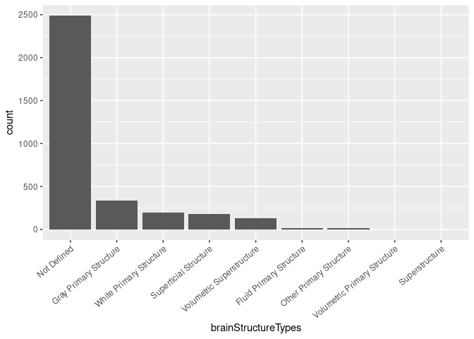

Neuronames Dataset
================
Richard Lea
2022-04-1

``` r
neuroNames <- readr::read_rds("./data/NeuroNames.rds")
```

## BrainNames Overview

``` r
ggplot(neuroNames) +
  geom_bar(aes(x = forcats::fct_infreq(brainStructureType))) +
  theme(axis.text.x = element_text(angle = 40, vjust = 1, hjust = 1)) +
  xlab("brainStructureTypes")
```

<!-- -->

## References

-   BrainInfo (1991-present), National Primate Research Center,
    University of Washington, <http://www.braininfo.org>.
